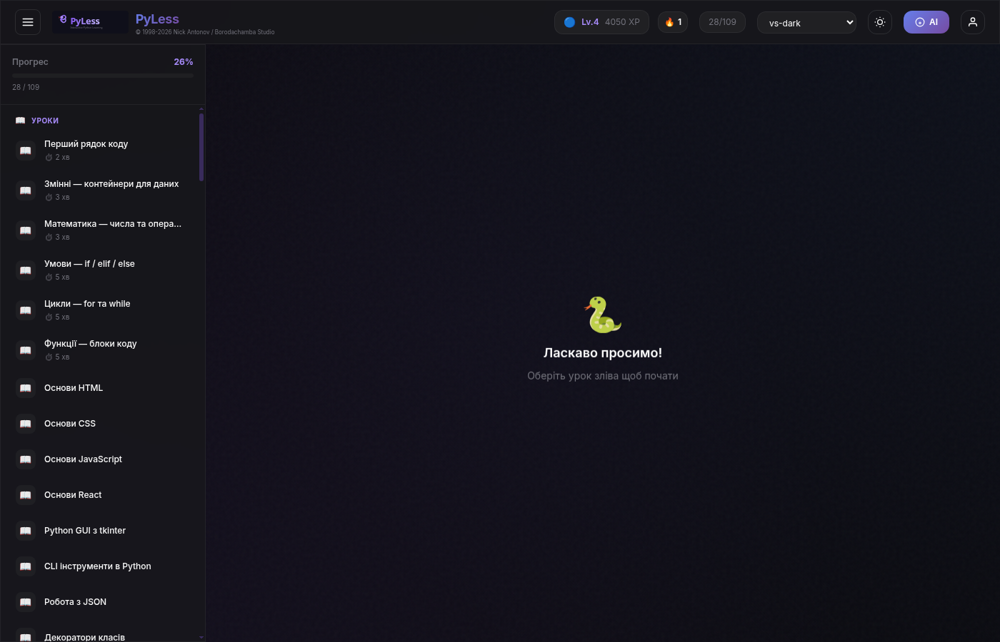
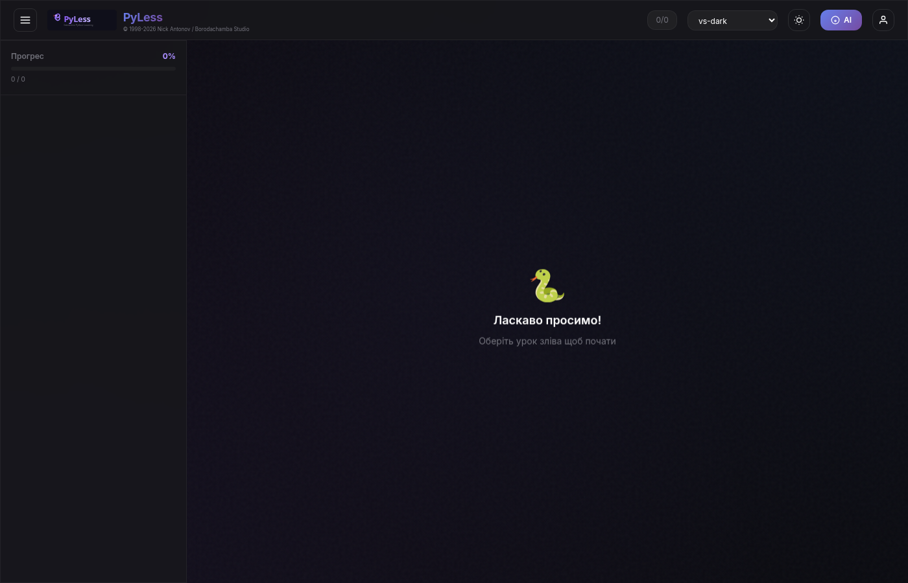
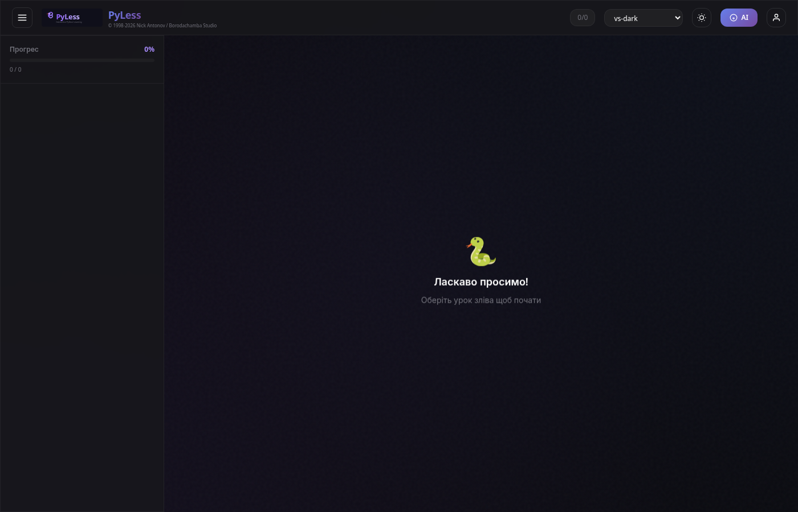

# 🐍 PyLess — Інтерактивна платформа вивчення Python

> Безкоштовна open-source альтернатива платним платформам навчання програмуванню

[](https://www.gnu.org/licenses/gpl-3.0)
[](https://python.org)
[](https://reactjs.org)
[](https://fastapi.tiangolo.com)

---

## 📸 Скріншоти

| Редактор | Головна сторінка | Модулі |
|----------|-----------------|--------|
|  |  |  |

---

## ✨ Можливості

### Для учнів
- 🎯 **109+ вправ** у 23 модулях (Python, HTML, CSS, JavaScript, React, SQL, API, ORM)
- 🐍 **Виконання Python в браузері** через Pyodide (без сервера)
- 🌐 **Багатомовний редактор коду** з Monaco (20 тем)
- 🏆 **Гейміфікація**: XP, рівні, стріки, комбо-множники, 20+ бейджів
- 📱 **Split-view по freeCodeCamp**: завдання зліва, редактор справа
- 💡 **Прогресивні підказки**: показуй по одній
- 🔥 **Щоденні челенджі** з таймером відліку
- 🤖 **AI-тутор** на базі Groq (llama-3.3-70b-versatile)

### Для викладачів
- 👥 **Групи учнів**: створюй групи, додавай учнів по email
- 📝 **Створення завдань**: створюй та призначай завдання групам або окремим учням
- 🎥 **Відео-уроки**: WebRTC P2P відео-чат з демонстрацією екрану
- 📎 **Завантаження матеріалів**: презентації, фото, відео
- 📊 **Управління учнями**: відстежуй прогрес, нотатки, статистику

### Для адміністраторів
- ⚙️ **Адмін-панель**: огляд, учні, запрошення, завдання, налаштування
- 🔐 **Google OAuth**: налаштовується в адмін-панелі
- 🔗 **Система запрошень**: генеруй коди для запису учнів
- 🌐 **Налаштовуваний**: назва сайту, опис, AI-ключ — все в UI
- 📊 **Аналітика**: кількість користувачів, виконані завдання, аптайм

---

## 🚀 Швидкий старт

### Варіант 1: Встановлення однією командою (Linux сервер)

```bash
curl -fsSL https://raw.githubusercontent.com/nickantonov/PyLess/main/install.sh | sudo bash
```

### Варіант 2: Ручне встановлення

```bash
# Клонування
git clone https://github.com/nickantonov/PyLess.git
cd PyLess

# Бекенд
pip install -r requirements.txt
export GROQ_API_KEY="ваш-ключ"
python3 -m uvicorn backend.main:app --host 0.0.0.0 --port 8000

# Фронтенд (окремий термінал)
cd frontend
npm install
npm run dev
```

### Варіант 3: Docker

```bash
docker compose up --build
```

📖 **Повна інструкція з встановлення**: [docs/INSTALL.md](docs/INSTALL.md)

---

## 📚 Документація

| Документ | Опис |
|----------|------|
| [docs/USERS.md](docs/USERS.md) | Гайд для учнів: як користуватися PyLess |
| [docs/TEACHERS.md](docs/TEACHERS.md) | Гайд для викладачів: групи, завдання, відео-уроки |
| [docs/ENGINEERING.md](docs/ENGINEERING.md) | Технічна документація: архітектура, стек, гайд по коду |
| [docs/INSTALL.md](docs/INSTALL.md) | Інструкція з встановлення |

---

## 🏗️ Технологічний стек

```
┌─────────────────────────────────────────────────────┐
│                    Фронтенд                          │
│  React 18 + TypeScript + Vite + TailwindCSS         │
│  Monaco Editor (CDN) + Pyodide (CDN)                │
│  Zustand (стан) + WebRTC (відео)                    │
└─────────────────────┬───────────────────────────────┘
                      │ REST API + WebSocket
┌─────────────────────┴───────────────────────────────┐
│                     Бекенд                           │
│  FastAPI + SQLite + Pydantic                        │
│  Groq AI (llama-3.3-70b) + JWT автентифікація      │
│  WebRTC signaling + Завантаження файлів             │
└─────────────────────┬───────────────────────────────┘
                      │
┌─────────────────────┴───────────────────────────────┐
│                   Інфраструктура                     │
│  Nginx (реверс-проксі) + Let's Encrypt / Cloudflare │
│  Systemd + Docker + GitHub Actions CI/CD            │
└─────────────────────────────────────────────────────┘
```

### Бекенд
- **FastAPI** — async Python веб-фреймворк
- **SQLite** — легка база даних (без сервера)
- **Pydantic** — валідація даних
- **JWT** — автентифікація (авто-генерація секретів)
- **bcrypt** — хешування паролів
- **Groq API** — AI-тутор (llama-3.3-70b-versatile)

### Фронтенд
- **React 18** — UI фреймворк
- **TypeScript** — типізація
- **Vite** — швидка збірка
- **TailwindCSS** — утилітарний CSS
- **Zustand** — легке управління станом
- **Monaco Editor** — редактор VS Code (CDN)
- **Pyodide** — Python в браузері (CDN)
- **WebRTC** — P2P відео-чат

---

## 📁 Структура проєкту

```
PyLess/
├── backend/
│   ├── main.py              # FastAPI додаток, роутери, static serving
│   ├── db.py                # SQLite схема, міграції
│   ├── models.py            # Pydantic моделі
│   ├── gamification.py      # XP, рівні, бейджі, стрік
│   ├── video_hub.py         # WebRTC signaling сервер
│   ├── routes/
│   │   ├── auth.py          # Реєстрація, вхід, Google OAuth
│   │   ├── tasks.py         # CRUD завдань, виконання, XP
│   │   ├── profile.py       # Профіль, рейтинг
│   │   ├── admin.py         # Адмін/ментор панель
│   │   ├── messages.py      # Чат система
│   │   ├── ai.py            # Groq AI-тутор
│   │   ├── settings.py      # Налаштування (key-value)
│   │   ├── groups.py        # Групи учнів
│   │   ├── custom_tasks.py  # Завдання від викладача
│   │   ├── video.py         # Відео-кімнати, матеріали
│   │   └── onboarding.py    # Визначення рівня (тест)
│   ├── tasks/               # 109+ JSON файлів вправ
│   │   ├── python/          # Python модулі (00-23)
│   │   └── ...
│   └── tests/               # 19 API тестів
├── frontend/
│   ├── src/
│   │   ├── App.tsx          # Кореневий компонент
│   │   ├── store.ts         # Zustand стан
│   │   ├── types.ts         # TypeScript типи
│   │   └── components/      # 18 React компонентів
│   ├── index.html
│   └── package.json
├── docs/                    # Документація
├── scripts/                 # Скрипти бекапу
├── install.sh               # Авто-встановлювач
├── docker-compose.yml       # Розробка
├── docker-compose.prod.yml  # Продакшен (Nginx + SSL)
├── Dockerfile
├── nginx.conf
├── requirements.txt
└── LICENSE                  # GPL-3.0
```

---

## 🎓 Навчальні модулі (23 модулі, 109+ вправ)

| # | Модуль | Вправи | Теми |
|---|--------|--------|------|
| 1 | Змінні | 5 | Змінні, типи, ввід/вивід |
| 2 | Оператори | 4 | Арифметичні, порівняння, логічні |
| 3 | Умови | 6 | if/elif/else, тернарний, вкладені |
| 4 | Цикли | 4 | for, while, break/continue |
| 5 | Функції | 6 | Параметри, return, *args, lambda |
| 6 | Списки | 6 | Масиви, зрізи, comprehension |
| 7 | Словники | 5 | Ключ-значення, методи, вкладені |
| 8 | Файли | 4 | Читання/запис, контекстні менеджери |
| 9 | Винятки | 3 | try/except, кастомні винятки |
| 10 | ООП | 4 | Класи, наслідування, декоратори |
| 11 | HTML | 4 | Теги, форми, семантика |
| 12 | CSS | 4 | Селектори, Flexbox, Grid |
| 13 | JavaScript | 4 | Змінні, функції, масиви |
| 14 | React | 4 | Компоненти, стан, списки |
| 15 | GUI | 4 | Основи tkinter |
| 16 | CLI | 4 | sys.argv, argparse |
| 17 | Файли (прос.) | 4 | JSON, CSV, pathlib |
| 18 | OOP (прос.) | 4 | property, classmethod, контекстні менеджери |
| 19 | БД: Основи | 4 | CREATE, INSERT, SELECT |
| 20 | БД: Запити | 4 | WHERE, JOIN, GROUP BY |
| 21 | БД: Просунуте | 4 | Транзакції, підзапити, індекси |
| 22 | API | 5 | requests, REST, async |
| 23 | ORM | 5 | SQLAlchemy моделі, CRUD, зв'язки |

---

## 🔧 Конфігурація

### Змінні середовища

| Змінна | Обов'язкова | Опис |
|--------|-------------|------|
| `GROQ_API_KEY` | Ні | Ключ AI-тутора (налаштовується в адмін-панелі) |
| `JWT_SECRET` | Ні | Генерується автоматично |
| `CORS_ORIGINS` | Ні | Домени через кому |
| `DB_DIR` | Ні | Директорія БД (за замовчуванням: backend/) |

### Налаштування в адмін-панелі

Після першого входу налаштуйте в адмін-панелі (⚙️):
- Ключ Groq AI API
- Облікові дані Google OAuth
- Назва та опис сайту

---

## 🧪 Тестування

```bash
# Тести бекенду (19 тестів)
python3 -m pytest backend/tests/ -v

# Збірка фронтенду
cd frontend && npm run build
```

---

## 🤝 Участь у розробці

1. Зробіть форк репозиторію
2. Створіть гілку функціоналу (`git checkout -b feature/amazing-feature`)
3. Закомітьте зміни (`git commit -m 'Add amazing feature'`)
4. Запуште (`git push origin feature/amazing-feature`)
5. Відкрийте Pull Request

---

## 📄 Ліцензія

Цей проєкт ліцензується за **GNU General Public License v3.0** — див. файл [LICENSE](LICENSE).

```
Copyright (c) 1998-2026 Nick Antonov (nick.antonov1@gmail.com)
Borodachamba Studio. Всі права захищені.

Ця програма є вільним програмним забезпеченням. Ви можете
розповсюджувати її та/або змінювати відповідно до умов
GNU General Public License, опублікованої Free Software Foundation,
версії 3 цієї ліцензії або (на ваш вибір) будь-якої пізнішої версії.
```

---

## 👤 Автор

**Nick Antonov** — [nick.antonov1@gmail.com](mailto:nick.antonov1@gmail.com)

**Borodachamba Studio** — © 1998-2026

---

## 🙏 Подяки

- [FastAPI](https://fastapi.tiangolo.com/) — сучасний Python веб-фреймворк
- [Pyodide](https://pyodide.org/) — Python в браузері
- [Monaco Editor](https://microsoft.github.io/monaco-editor/) — редактор VS Code
- [Groq](https://groq.com/) — швидкий AI-інференс
- [freeCodeCamp](https://www.freecodecamp.org/) — натхнення для моделі навчання
